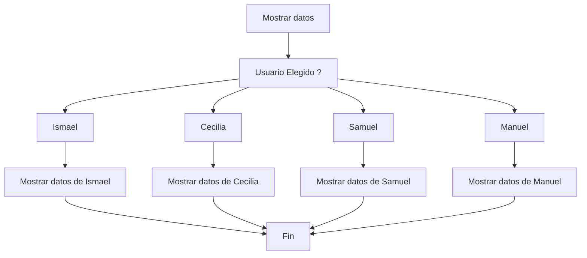

# learn-java
# Documentación
[Nontion Documentación Java](https://www.notion.so/Java-y-Java-Spring-boot-Bases-e3c1547b9d634ba6b226cb97cd668be7?showMoveTo=true&saveParent=true)

## Tipos de datos
| Nombre | Tipo  | Valores |
|--|--|--|
| Entero  | int  | 0,1,35,120,44 |
| Decimales  | double  |1,5; 5,6 |
|Booleanos   | Boolean  |  true o false|
|Caracters | char | 'a'; 'b'; Este solo es un caracter |
|Cadena de caracteres/texto| String| "Hola mundo, probando" |
| Entero Largo| long | numeros entre (-9.223.372.036.854.775.808, 9.223.372.036.854.775.808) |

## Declaracion de variables

 int numero; 
- tipo de dato `int`
-	nombre `numero` 


## Operadores aritméticos

**Un operador** es un **símbolo especial** que indica que se debe efectuar una determinada operación. Estas operaciones pueden ser de asignación, aritméticas, condicionales, relacionales, entre otras. algunas de las más conocidas son:


## Condicional Simple: IF

La  estructura de control  **IF**  permite decidir entre dos opciones resultantes de la evaluación de una condición. Si ésta se cumple, se ejecuta una parte de código, caso contrario, se sigue de largo o, en su defecto se ejecuta el código que se encuentra dentro de una sentencia  **else**.

# Switch 

La estructura “Switch” permite múltiples caminos a partir de la evaluación de una sola expresión/condición. La construcción de esta estructura se ejecuta mediante la evaluación de la condición y un conjunto de casos llamados cases.

Cada case es una posible respuesta a la evaluación de esa condición, si el valor que se busca coincide con algún case, se ejecuta el mismo hasta la sentencia break o hasta el final del Switch (dependiendo del caso).



# Operador Ternario

El operador ternario, es un operador en programación que permite tomar decisiones basadas en una condición y asignar un valor a una variable o expresión en función de si la condición es verdadera o falsa.

Este operador se caracteriza por su sintaxis compacta y su capacidad para simplificar la escritura de condicionales simples en una sola línea de código.

Posee tres principales partes en su estructura:

 - Condición: Una expresión que se evalúa como verdadera o falsa.
 - Valor_si_verdadero: El valor que se asignará a la variable si la   
   condición es verdadera.
 - Valor_si_falso: El valor que se asignará a la variable si la   
   condición es falsa

```   variable = ( condicion  ) ? valor_si_verdadero: valor_si_falso  ```