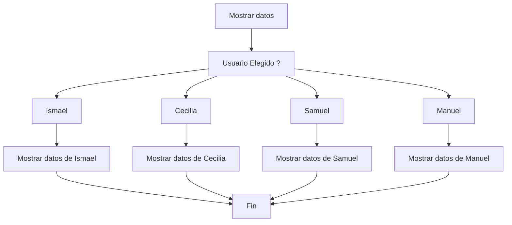
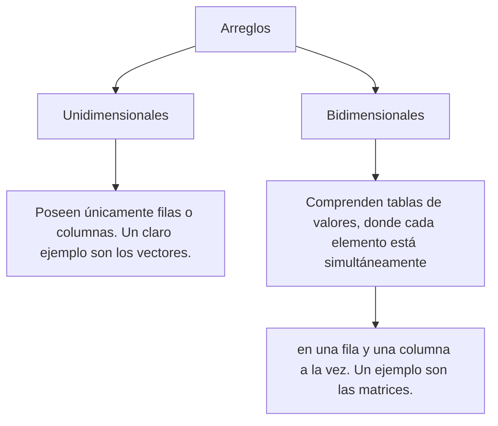

# BASES JAVA DOCUEMENTACION
[Nontion Documentación Java](https://www.notion.so/Java-y-Java-Spring-boot-Bases-e3c1547b9d634ba6b226cb97cd668be7?showMoveTo=true&saveParent=true)

## Tipos de datos
| Nombre | Tipo  | Valores |
|--|--|--|
| Entero  | int  | 0,1,35,120,44 |
| Decimales  | double  |1,5; 5,6 |
|Booleanos   | Boolean  |  true o false|
|Caracters | char | 'a'; 'b'; Este solo es un caracter |
|Cadena de caracteres/texto| String| "Hola mundo" |
| Entero Largo| long | numeros entre (-9.223.372.036.854.775.808, 9.223.372.036.854.775.808) |

## Declaracion de variables

 int numero; 
- tipo de dato `int`
-	nombre `numero` 


## Operadores aritméticos

**Un operador** es un **símbolo especial** que indica que se debe efectuar una determinada operación. Estas operaciones pueden ser de asignación, aritméticas, condicionales, relacionales, entre otras. algunas de las más conocidas son:


## Condicional Simple: IF

La  estructura de control  **IF**  permite decidir entre dos opciones resultantes de la evaluación de una condición. Si ésta se cumple, se ejecuta una parte de código, caso contrario, se sigue de largo o, en su defecto se ejecuta el código que se encuentra dentro de una sentencia  **else**.

# Switch 

La estructura “Switch” permite múltiples caminos a partir de la evaluación de una sola expresión/condición. La construcción de esta estructura se ejecuta mediante la evaluación de la condición y un conjunto de casos llamados cases.

Cada case es una posible respuesta a la evaluación de esa condición, si el valor que se busca coincide con algún case, se ejecuta el mismo hasta la sentencia break o hasta el final del Switch (dependiendo del caso).



# Operador Ternario

El operador ternario, es un operador en programación que permite tomar decisiones basadas en una condición y asignar un valor a una variable o expresión en función de si la condición es verdadera o falsa.

Este operador se caracteriza por su sintaxis compacta y su capacidad para simplificar la escritura de condicionales simples en una sola línea de código.

Posee tres principales partes en su estructura:

 - Condición: Una expresión que se evalúa como verdadera o falsa.
 - Valor_si_verdadero: El valor que se asignará a la variable si la condición es verdadera.
 - Valor_si_falso: El valor que se asignará a la variable si la condición es falsa

```   variable = ( condicion  ) ? valor_si_verdadero: valor_si_falso  ```


# Estructuras Repetitivas: Bucles Infinitos

De a poquito vamos entendiendo lo que son las estructuras repetitivas, y al usarlas tenemos que saber que podemos cometer muchos errores. Uno de los errores más conocidos es la generación de «Bucles Infinitos». En el video a continuación te contamos un poco ¿Cómo se producen? y por supuesto, ¿Cómo evitarlos?.

# Estructuras Repetitivas: FOR

Así como tenemos a la estructura While, que puede ser controlada tanto por centinelas como por contadores, también contamos con otra estructura que es considerada como la preferida a la hora de ejecutar bucles controlados por contador. Esta estructura es el conocido FOR.

La estructura FOR, está compuesta por tres partes:

Inicialización de la variable que utilizaremos en la condición (se ejecuta solo una vez al principio del ciclo).
Condición de fin del ciclo (se evalúa esta expresión al comienzo de cada iteración).
Modificación (incremento o decremento) de la variable (se ejecuta al final de cada iteración).

# VECTORES: Declaración y Asignación

Los arreglos (o arrays) son un conjunto de datos que se almacenan en memoria de manera contigua con el mismo nombre, pero con diferentes índices para diferenciar cada un de ellos. Son estructuras fijas que se declaran y que mantienen su tamaño durante toda la ejecución del programa. Si declaro un arreglo de 5 posiciones, mantendrá esas 5 posiciones siempre.

Existen arreglos unidimensionales y bidimensionales. Entre los unidimensionales (una sola dimensión), tenemos a los vectores, a quienes conoceremos en el video a continuación.

---

## Arreglos (Arrays)

- Los arreglos (o arrays) son un conjunto de datos que se almacenan en memoria de manera contigua con el mismo nombre, pero con diferentes índices para diferenciar cada uno de ellos.

- Los arreglos son estructuras fijas que se declaran y que mantienen su tamaño durante toda la ejecución del programa. Si declaro un arreglo de 5 posiciones, mantendrá esas 5 posiciones.

- Cada arreglo que se cree puede ser de un determinado tipo de datos y puede almacenar solo valores de ese tipo.

### Ejemplo de un arreglo:

| Índice | 0  | 1  | 2  | 3  | 4  | 5  | 6  | 7  |
|--------|----|----|----|----|----|----|----|----|
| Valor  | 35 | 40 | 23 | 11 | 91 | 16 | 7  | 12 |

---

## Tipos de Arreglos



## Ejemplo de Matriz Bidimensional en Java

Una **matriz bidimensional** es una estructura de datos que se organiza en filas y columnas. En este ejemplo, la matriz tiene un tamaño de **3x3**, lo que significa que contiene 3 filas y 3 columnas.

Cada celda en la matriz puede ser identificada usando un par de índices: uno para la fila y otro para la columna.

### Representación de una Matriz 3x3

|   | 0   | 1   | 2   |
|---|-----|-----|-----|
| 0 | 23    |  4   |     |
| 1 |     |  6   |    6 |
| 2 |  4  |   6  |     |

En esta tabla:

- **Filas** están numeradas como 0, 1, y 2.
- **Columnas** están numeradas como 0, 1, y 2.

#### Ejemplo de Código en Java

```java

// Inicialización de una matriz 3x3 en Java con valores predeterminados de 0
int[][] matriz = new int[3][3];

// Acceso y modificación de los elementos de la matriz
// matriz[fila][columna]
// Ejemplos:
matriz[0][0] = 1; // Asigna el valor 1 al primer elemento (esquina superior izquierda)
matriz[2][2] = 9; // Asigna el valor 9 al último elemento (esquina inferior derecha)

// Imprimir la matriz
// Es una matriz de doble for
for (int i = 0; i < matriz.length; i++) {
    for (int j = 0; j < matriz[i].length; j++) {
        System.out.print(matriz[i][j] + " ");
    }
    System.out.println();
}


```

Mapa


